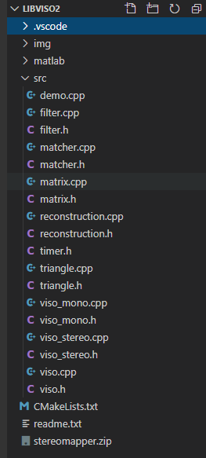

# LIBVISO2

**[LIBVISO2 (Library for Visual Odometry 2)](http://www.cvlibs.net/software/libviso/)** 是AVG(Autonomous Vision Group)小组的开源项目。

它是一个用于计算移动单目/双目相机的6DoF运动的跨平台C++库，libviso2 不依赖其他CV库，独立的实现了视觉里程计。这是一个非常简单的开源的视觉里程计算法，非常简单啊，特别适合初学者作为入门的第一款视觉里程计算法。

本文将详细介绍 libviso2 双目视觉里程计部分的实现原理和代码讲解。

# 一起读代码

打开工程，在/src下面可以看见libviso2的C++源代码，密密麻麻一大堆头文件和源文件。



下载一下test用到的数据库，再编译运行一下，可以看到 Current pose 被连续不断的打印到屏幕上。

[pic] //TODO

别慌，咱们一起来看看这个代码的运行流程，先从main() 函数所在的 demo.cpp 开始。

+ demo.cpp

```c++
// demo.cpp
// include <balabala>
// using namespace
int main (int argc, char** argv) {
	init_parameters();	// 40-65行，初始化各种参数
    for (int32_t i=0; i<373; i++) { 	// 68行开始循环
    	read_images();	// 70-96行，读取图片，并且将图片转换数据格式
        // 在这里，viso.process() 是核心，在proscess()函数中完成了所有的主要工作
        // 传入读取到的当前帧的图片，proscess()函数就会计算出前帧图片的位姿变换
        // 并将各种参数更新，保存在VO对象属性的变量中，并返回一个bool类型
        if (viso.process(left_img_data,right_img_data,dims)) {
        	// process()函数处理当前帧图片的位姿变换，处理成功则返回true
            pose = pose * Matrix::inv(viso.getMotion());	// 更新当前的位姿
        	print_information();	// 108-113行，打印信息
        }
        else {
            // process()失败则不更新，跳过这帧处理下一帧
        	cout << " ... failed!" << endl;		
      	}
        release_buffers();	//释放内存
        catch();	// 有错报错
    }
    return 0;	// 结束
}
```

		看完了demo.cpp，我们惊奇的发现，我们看懂了99%的代码，但是对视觉里程计一无所知，所有能看懂的都是废话，等于没看。唯独 viso.process() 函数不知道是什么，但是关键的关键都包含在了 viso.process() 函数中。那么就让我们跳转到 viso.process() 函数中看看。

+ viso_stereo.cpp

```c++
// viso_stereo.cpp
bool VisualOdometryStereo::process (uint8_t *I1,uint8_t *I2,int32_t* dims,bool replace) {
  
  // push back images
  matcher->pushBack(I1,I2,dims,replace);
  
  // bootstrap motion estimate if invalid
  if (!Tr_valid) {
    matcher->matchFeatures(2);
    matcher->bucketFeatures(param.bucket.max_features,param.bucket.bucket_width,param.bucket.bucket_height);                          
    p_matched = matcher->getMatches();
    updateMotion();
  }
  
  // match features and update motion
  if (Tr_valid) matcher->matchFeatures(2,&Tr_delta);
  else          matcher->matchFeatures(2);
  matcher->bucketFeatures(param.bucket.max_features,param.bucket.bucket_width,param.bucket.bucket_height);                          
  p_matched = matcher->getMatches();
  return updateMotion();
}
```