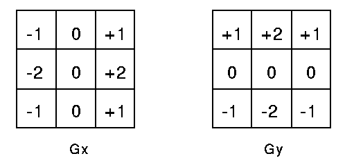
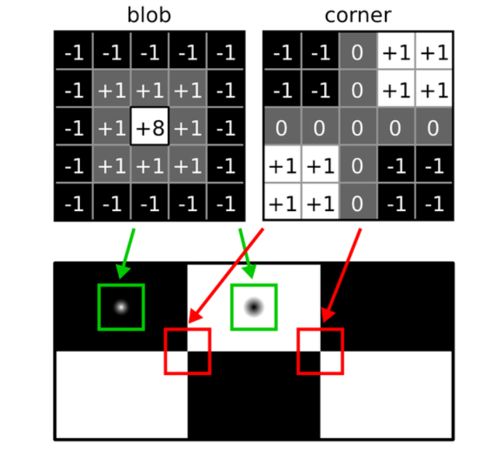
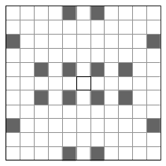
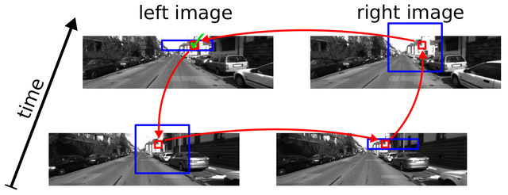
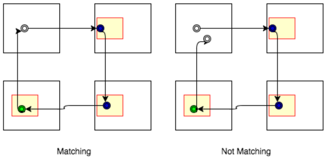
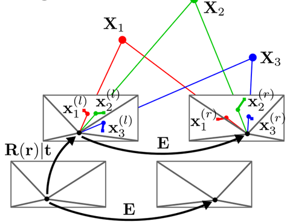
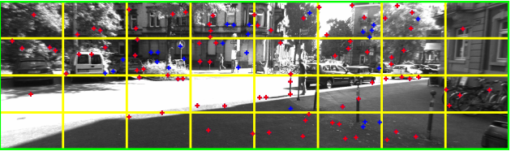

# LIBVISO2

**[LIBVISO2 (Library for Visual Odometry 2)](http://www.cvlibs.net/software/libviso/)** 是AVG(Autonomous Vision Group)小组的开源项目。

它是一个用于计算移动单目/双目相机的6DoF运动的跨平台C++库，libviso2 不依赖其他CV库，独立的实现了视觉里程计。这是一个非常简单的开源的视觉里程计算法，非常简单啊，特别适合初学者作为入门的第一款视觉里程计算法。

本文将详细介绍 libviso2 双目视觉里程计部分的实现原理和运动估计部分代码讲解。

# 一起读代码

打开工程，在/src下面可以看见libviso2的C++源代码，密密麻麻一大堆头文件和源文件。


下载一下test用到的数据库，再编译运行一下，可以看到 Current pose 被连续不断的打印到屏幕上。

[pic] //TODO

别慌，咱们一起来看看这个代码的运行流程，先从main() 函数所在的 demo.cpp 开始。

+ demo.cpp

```c++
// demo.cpp
// include <balabala>
// using namespace
int main (int argc, char** argv) {
	init_parameters();	// 40-65行，初始化各种参数
    for (int32_t i=0; i<373; i++) { 	// 68行开始循环
    	read_images();	// 70-96行，读取图片，并且将图片转换数据格式
        // 在这里，viso.process() 是核心，在proscess()函数中完成了所有的主要工作
        // 传入读取到的当前帧的图片，proscess()函数就会计算出前帧图片的位姿变换
        // 并将各种参数更新，保存在VO对象属性的变量中，并返回一个bool类型
        if (viso.process(left_img_data,right_img_data,dims)) {
        	// process()函数处理当前帧图片的位姿变换，处理成功则返回true
            pose = pose * Matrix::inv(viso.getMotion());	// 更新当前的位姿
        	print_information();	// 108-113行，打印信息
        }
        else {
            // process()失败则不更新，跳过这帧处理下一帧
        	cout << " ... failed!" << endl;		
      	}
        release_buffers();	//释放内存
        catch();	// 有错报错
    }
    return 0;	// 结束
}
```

看完了demo.cpp，我们惊奇的发现，我们看懂了99%的代码，但是对视觉里程计一无所知，所有能看懂的都是废话，等于没看。唯独 viso.process() 函数不知道是什么，但是关键的关键都包含在了 viso.process() 函数中。那么就让我们跳转到 viso.process() 函数中看看。

+ viso_stereo.cpp

```c++
// viso_stereo.cpp
bool VisualOdometryStereo::process (uint8_t *I1,uint8_t *I2,int32_t* dims,bool replace) {
  // 35-50行，也就是从这里开始到return 之前，都是在做图像特征的提取和匹配
  matcher->pushBack(I1,I2,dims,replace);	// 特征提取
  // 两次匹配策略加速匹配
  if (!Tr_valid) {	// 第一次匹配
    matcher->matchFeatures(2);	// 特征匹配
    // Bucketing处理
    matcher->bucketFeatures(param.bucket.max_features,param.bucket.bucket_width,param.bucket.bucket_height);
    p_matched = matcher->getMatches();	// 更新匹配点
    updateMotion();
  }
  // 第二次匹配
  if (Tr_valid) matcher->matchFeatures(2,&Tr_delta);
  else          matcher->matchFeatures(2);
  matcher->bucketFeatures(param.bucket.max_features,param.bucket.bucket_width,param.bucket.bucket_height);
  p_matched = matcher->getMatches();
  // 得到匹配好的点后，就可以进行运动估计了
  // 运动估计的部分被包含在了updateMotion() 函数中
  return updateMotion();
}
```

process() 函数中分为两部分，特征匹配和运动估计。99%的代码是在做特征匹配，而运动估计部分只在最后一行的 return 中 调用了 updateMotion() 函数。updateMotion() 函数定义在了 VisualOdometryStereo 类的父类 VisualOdometry 中，并且没有在子类中被重写，那让我们跳转到updateMotion() 中。

+ viso.cpp

```c++
// viso.cpp
bool VisualOdometry::updateMotion () {
  // updateMotion () 调用 estimateMotion() 返回估计好的位姿变换 T和r
  vector<double> tr_delta = estimateMotion(p_matched);
  if (tr_delta.size()!=6)	//返回的T和r无效返回false
    return false;

  // 返回的T和r有效则更新位姿变换，再返回true
  Tr_delta = transformationVectorToMatrix(tr_delta);
  Tr_valid = true;
  return true;
}
```

updateMotion() 函数中的主要工作又被封装到了 estimateMotion() 函数中了，estimateMotion()函数才是做了真正的运动估计，返回了估计好的位姿变换T和r。updateMotion() 函数再根据估计好的位姿的有效性（运动估计无效 estimateMotion() 会返回空向量）做一个更新和返回。那再继续去看estimateMotion() 函数吧。

+ viso_stereo.cpp

```c++
vector<double> VisualOdometryStereo::estimateMotion (vector<Matcher::p_match> p_matched) {
  
  bool success = true;  // 声明返回值
  
  min_distance();	// 59-65行，计算RANSAC的最小距离
  
  int32_t N  = p_matched.size();	// 67-70行，得到匹配点的数量，必须大于等于6个

  memory = new <type>[N];	// 72-79行，创建动态变量用于计算

  for (i=0; i<N; i++) {
    project_points(points[i]);	// 81-87行，将前一时刻两图中匹配好的特征点投影成3D点，计算出这些特征点的3D坐标
  }

  before_loop();	// 89-95行，准备开始RANSAC循环，声明临时变量

  for (int32_t k=0;k<ransac_iters;k++) {	// 97-114行，RANSAC迭代进行运动估计
    RANSAC();		// RANSAC算法，后面详细介绍
    while (result==UPDATED) {
      result = updateParameters();	// 107-114行，updateParameters()函数实现了高斯牛顿法迭代优化
    }
    overwrite_best_param();		// 116-123行，RANSAC算法中，将参数更新为内点最多的一组
  }
  
  refinement();		// 126-134行，再优化
  return();			// 136-157行，delete临时变量，返回
```


# 原理

+ 一般的基于特征点的VO算法分为如下几个步骤：


## 特征匹配部分

+ [高斯拉普拉斯算子](http://homepages.inf.ed.ac.uk/rbf/HIPR2/log.htm)

  Laplace算子作为一种优秀的边缘检测算子，在边缘检测中得到了广泛的应用。该方法通过对图像求图像的二阶倒数的零交叉点来实现边缘的检测，公式表示如下：

  

  由于Laplace算子是通过对图像进行微分操作实现边缘检测的，所以对离散点和噪声比较敏感。于是，首先对图像进行高斯卷积滤波进行降噪处理，高斯函数的表达式如下：

  

  =\frac{1}{\sqrt{2\pi\sigma^2}}e^{-\frac{x^2+y^2}{2\sigma^2}})

  

  再将Laplace算子应用于高斯卷积滤波后的图像：

  *f(x,y)]=[\Delta%20G_\sigma(x,y)]*f(x,y)=LoG*f(x,y))

  如此，拉普拉斯高斯算子LoG（Laplace of Gaussian）就诞生了。这样就可以提高Laplace算子对噪声和离散点的鲁棒性。

   2D高斯拉普拉斯算子可以通过任何一个方形核进行逼近，只要保证该核的所有元素的和或均值为0，如后文的Blob Musk就是一个5x5的核逼近的拉普拉斯高斯算子。

+ [Sobel 滤波](https://homepages.inf.ed.ac.uk/rbf/HIPR2/sobel.htm)

  Sobel 滤波是获得数字图像的一阶梯度的方法，使用索贝尔算子把图像中每个像素的上下左右四领域的灰度值加权求和，来运算图像亮度函数的梯度之近似值。

  该算子包含一对儿3x3的矩阵，分别为横向及纵向，如下图所示，将之与图像作平面卷积（将kernels应用于图像），即可分别得出横向及纵向的亮度差分近似值。

  

  图像梯度的大小和方向可由横向梯度Gx与纵向梯度Gy结合得到：

  

  )

+ SAD 算法

  SAD(Sum of absolute differences)是一种图像匹配算法。其基本思想是比较特征模板差的绝对值之和。此算法常用于图像块匹配，将每个像素对应数值之差的绝对值求和，据此评估两个图像块的相似度。
 ###  特征提取

+ Blob/Corner Detector

  
  
libviso2 采用 Blob/Corner Detector 两种特征模板来提取特征。如图所示，Blob Musk 是一个高斯拉普拉斯算子，它和 Corner Musk 分别检测边缘点和角点。采用非极大值抑制和非极小值抑制的方法保留局部极大值和极小值作为特征点。

+ Feature Descriptor

  

  采用如上图所示的模板作为特征点的描述子，在11x11的矩形中的16个位置，保留了图像的一阶梯度值（Sobel滤波），并且使用SAD算法进行特征模板匹配。为了加速特征匹配，特选取8 bits 的 Sobel 算子进行 Sobel 滤波，选取稀疏的16个点来代表整个矩形。这是因为在SAD算法中使用 16 bytes 的特征描述子做特征点匹配，计算机只需要调用一条简单的 SSE 指令就可以实现非常高效的进行计算。

### 环形匹配

+ Circle Strategy

  

  双目相机的特征匹配要对4幅图像进行匹配，环形匹配的策略是：从当前时刻的左图出发，对于每一个的特征点，先去前一时刻的左图中划一个M×M的窗口，在窗口中寻找最佳匹配点；再到前一时刻的右图中划定一个M×N的窗口，寻找到最佳匹配点；然后去当前时刻的右图中的M×M窗口中进行匹配；最后回到当前时刻的左图中M×N窗口内匹配。


+ Reject Mismatch

  

  如果环形匹配结束点和起始点是同一个点（允许1 pixel 的误差），那么这组匹配点作为正确匹配的特征点保留。否则认为是匹配失败，将这组点剔除。

### 快速匹配

在特征匹配过程中，libviso2使用有效的位姿变换信息来缩小特征匹配的搜索区域，以提高特征匹配速度。快速匹配策略将特征匹配分为两个阶段：在第一阶段中，算法选取一部分稀疏的特征点进行匹配，根据这一部分点的匹配信息，计算出相机前后时刻大致的位姿变换。在第二阶段中，算法根据有效的相机位姿变换，预测出当前时刻左图中的特征点在其他3幅图中可能出现的区域，在此区域内进行搜索匹配。先用少数特征点进行全局匹配，再计算出大致的前后时刻相机位姿变换，然后对剩余的所有特征点，利用相机位姿变换信息缩小搜索的区域，这样可大幅提高特征匹配的速度。


## 运动估计部分



### 特征 Bucketing



在做运动估计计算之前，首先采用Bucket策略进一步减少或者说均衡特征点。图像被均分为很多长方形区域，每个区域限制特征点个数的最大值。如上图所示，图像被分割成若干个矩形区域，在每个矩形区域中只保留最多n个点。

+ 这样做的好处是
  + 减少特征点的总数量，提高算法效率
  + 使特征点均匀的分布在图像中，避免很多特征点扎堆出现
  + 均衡不同深度的特征点分布，远近特征点均有机会被运动估计算法采用，从而提高了估计精度。

### 3D点计算

根据已匹配特征点的视差，计算出此点在三维空间内的坐标

+ 视差

  )

+ 双目相机基线

  

+ 投影到3d

  %20\cdot%20\frac{B}{d}%20\\%20Y%20=%20(v-c_v)%20\cdot%20\frac{B}{d}%20\end{cases}%20\end{aligned})


%20\quad%20\mathbf{t}%20\left(%20\begin{array}{cccc}%20X_p%20\\%20Y_p%20\\%20Z_p%20\end{array}%20\right)%20-%20\left(%20\begin{array}{cccc}%20s%20\\%200%20\\%200%20\end{array}%20\right)%20\end{bmatrix})


![](http://latex.codecogs.com/gif.latex?


### 投影模型


### Minimize Reprojection Errors


### RANSAC


### Gauss-Newton optimization


# 关键部分代码详细注释和讲解

// TODO